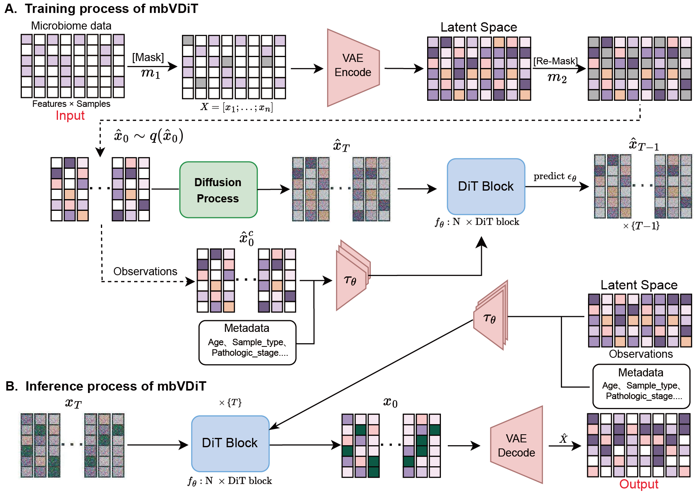

# Pretrained-Guided Conditional Diffusion Models for Microbiome Data Denoising and Imputation

## Introduction
In this paper, we introduce a novel method for microbiome data imputation, mbVDiT. Our approach primarily combines the excellent capabilities of variational autoencoders(VAE) in learning latent distributions and diffusion models in generating new data that conforms to the real data distribution. To address the issue of unlabeled microbiome data, we drew inspiration from recent research in the fiel. We masked a portion of the original data, which remained invisible throughout the entire modeling process and served as labels for evaluating the imputation performance after filling. After the masked data is encoded into the latent space by the VAE encoder, we re-mask the latent space and employ a conditional score-based diffusion model for training the denoising network. The re-masked data undergoes processing by the diffusion model. The unmasked part of the data and patient metadata serves as condition during this training phase. Our goal is to reconstruct a cancer microbiome data matrix by integrating various types of metadata information from patients and handling the label-less nature of the data.

## Installations
* Windows
* NVIDIA GPU (both pretrained VAE and trained mbVDiT on a single Nvidia GeForce RTX 3090)
* ``pip install -r requiremnts.txt``

## Data preprocessing
If you wish to perform data preprocessing, you can run the script in the Jupyter folder.

## Training mbVDiT
``python main.py``
